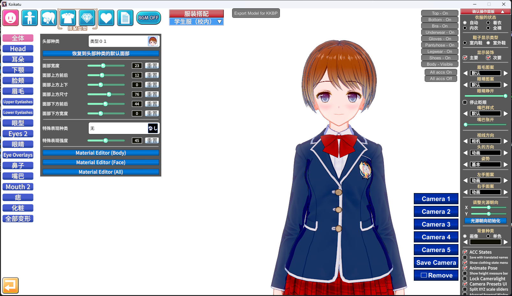

# 恋活(Koilkatsu)角色模型导出
## 0x000 前言
最近看了一个小说，有点上头，想自己整点mmd同人  
搜资料的时候正好发现有个大佬做了一个恋活的角色卡，遂嫖之  
借着这次机会，练习下使用Markdown，顺便把过程整理出来  
还是挺繁琐的，要倒好几个软件，不过据说这样可以避免模型动作错位，贴图错误之类的毛病  
折腾了两天，最后大概把流程整明白了，以此记录

## 0x001 准备工作
你需要的工具有：
1. [Koikatsu](https://store.steampowered.com/app/1073440/)
2. [KK-HF_Patch](https://github.com/ManlyMarco/KK-HF_Patch/)
3. [Blender 3.0.1](https://store.steampowered.com/app/365670/)
4. [KKBP&KK-Blender-Porter-Pack 5.1.1](https://github.com/FlailingFog/KK-Blender-Porter-Pack/)
5. [CATS 0.19.0](https://github.com/absolute-quantum/cats-blender-plugin)

KKHF 为 KK 的补丁，允许加载所有角色卡和场景  
KKBP 是 KK 的插件，允许你导出人物pmx模型  
KK-Blender-Porter-Pack为blender插件，允许你在blender操作pmx模型  
CATS  用于导入pmx模型

注意KKBP和KK-Blender-Porter-Pack的版本一定要对应  
现在KKBP已经更新到6.x，我使用的为5.1.1，操作有所变化，但大体相似

如果不知道下载哪个版本，我推荐在[这个视频](https://www.bilibili.com/video/BV1MM411e793)简介中的链接下载，Blender和KK的插件都已打包好，直接用就行

## 0x002 导出人物pmx模型
在giuthub上下载KK-HFPatch

HF不能直接通过github下载，需要使用如qBittorrent的BT软件

KKBP的下载我比较推荐使用上方视频简介中的链接下载

将HF下载好后安装到KK所在目录即可  
将下载好的KKBP插件放入<kbd>Koikatu\BepInEx\plugins\ </kbd>目录下

打开游戏，进入角色制作界面，画面上方出现如图"Export Model for KKBP"即为成功安装插件

现在读取你要导出的角色卡，选择衣服，勾选右边的"停止眨眼"

需要注意的是，有的角色卡使用了外部模型，因此需要额外添加一段恋活自带的头发，将后添加的头发挪到一边方便后面删掉

确认都调整好后就可以点击上方按钮进行导出
导出的模型会保存在<kbd>Koikatu\Export_PMX\ </kbd>目录下，导出后游戏也会自动打开这个目录

现在可以关掉游戏，进入Blender

## 0x003 Blender转换fbx模型
进入偏好设置，安装插件

安装完插件后，点击导入，选择导入pmx模型

选择刚才导出的角色文件夹根目录的pmx模型

导入后按下N键，选择KKBP,按下第一个按钮，耐心等待

完成之后我们进行头发处理

如果你的头发是恋活本身的，没有使用外部模型，就使用这里自动选上的部分，我这里的人物卡没有使用外部模型  
Alt+Z进入透明模式，按住Shift进行加选，确保吧头发全部选上

选上之后按Alt+Z退出透明模式，按P键，分离选中项

然后在右侧找到分离出的头发，重命名为"hair"

点击KKBP面板的第二个按钮，路径就选导出模型的目录

接着点击第三个按钮，选择同样的目录

点击第四个按钮

关闭骨架显示

现在开始调整模型，在最上方点击Shading  
选中模型，按tab键进入编辑模式，右键，选择按材质分离

然后按下tab回到物体模式，接下来调整模型中觉得不对劲的地方，推荐参考[BV1MM411e793](https://www.bilibili.com/video/BV1MM411e793/ )10分18秒和[BV1Sj411N7eQ](https://www.bilibili.com/video/BV1Sj411N7eQ)  
操作以具体模型为主，自由发挥的空间比较大

编辑完成后，回到Layout 将拆分的部分重新合并，命名为"body"，选中后点击KKBP的第五个按钮,选择一个文件夹导出材质文件

导出后的文件如图

选中"body" 按下KKBP第六个按钮，选择刚刚导出的材质文件，进行重新贴图，如果模型显示正常，那就恭喜你一切顺利

接下来打开CATS，点击导出

这里回弹出一个警告，忽略即可，点第一个按钮，继续导出，目录就选择导出材质的目录

导出的材质一共三份：light dark normal
至此，Blender的部分结束

## 0x004 Unity转换vrm模型
妈的，好难搞
## 0x005 VRoid输出pmx模型
## 0x00X 参考链接
https://www.bilibili.com/video/BV1MM411e793/  
https://www.bilibili.com/read/cv21400201/
